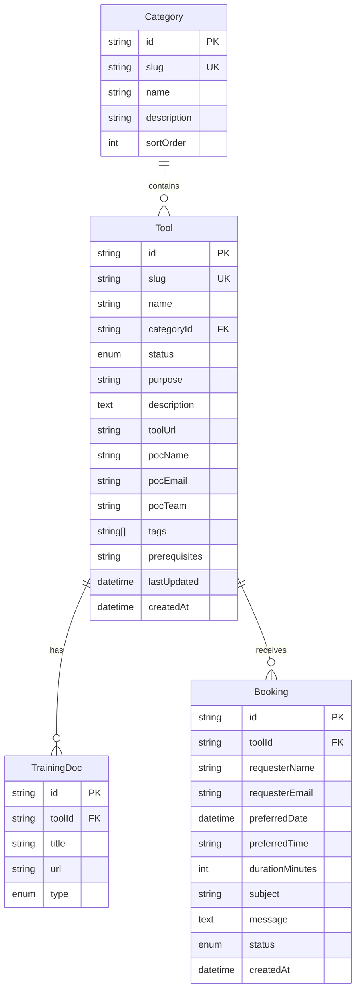
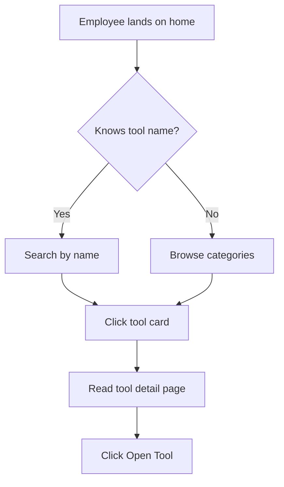
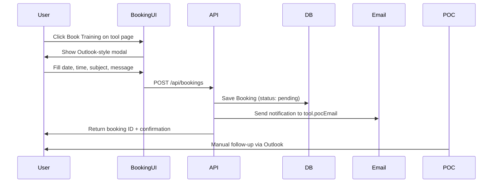
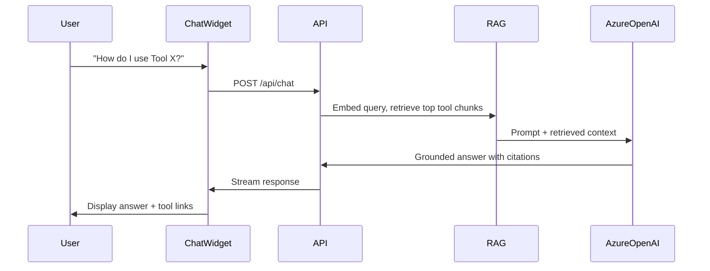

# Product Requirements Document (PRD)

## AI Hub Digital Tools Repository

| Field | Value |
|---|---|
| **Product name** | AI Hub Digital Tools Repository |
| **Display name** | AI Hub Tool Guide |
| **Version** | 0.1.1 (documentation) |
| **Owner** | Unilever AI Hub — Head Office |
| **Last updated** | 2026-06-25 |
| **Status** | Phase 0 complete — ready for Phase 1 |

---

## 1. Product Vision

Create a single, trusted internal website where Unilever Head Office employees can discover, understand, and get support for every digital tool available through the AI Hub. The site acts as a living repository: each tool has its own page with purpose, POC, links, and training resources, plus the ability to request training sessions and ask questions via an AI assistant.

**One-line pitch:** *"The internal app store and help desk for AI Hub digital tools."*

---

## 2. Problem Statement

Today, digital tools at the Unilever Head Office AI Hub are fragmented across SharePoint pages, email threads, Teams channels, and tribal knowledge. Employees face recurring friction:

- **Discovery** — "What tools exist and which one should I use?"
- **Context** — "What is this tool for and who owns it?"
- **Access** — "Where is the link and who do I contact?"
- **Onboarding** — "Where are the training docs and how do I book a session?"
- **Support** — "I have a quick question but don't know who to ask."

Without a central repository, adoption suffers, POCs get repeated questions, and the AI Hub team lacks visibility into demand.

---

## 3. Target Users

### Primary: Employees (Head Office)

- Browse and search the tool catalog
- Read tool detail pages (purpose, POC, links, training docs)
- Request training sessions via an Outlook-style booking interface
- Ask the chatbot questions about available tools

### Secondary: AI Hub Admins

- Add, edit, and deprecate tools via an in-app CMS
- Manage categories and tags
- View and respond to training booking requests
- Monitor chatbot usage (Phase 4+)

### Out of scope (MVP)

- External/public users
- Tool provisioning or license management
- Deep integration with IT service management (ServiceNow, etc.)

---

## 4. Goals & Success Metrics

| Goal | Metric | Target (6 months post-launch) |
|---|---|---|
| Improve tool discovery | Unique monthly visitors | 200+ Head Office employees |
| Reduce POC inbox noise | Booking requests via site vs ad-hoc email | 60%+ of training requests |
| Increase self-service | Chatbot sessions with cited answers | 70%+ resolution without escalation |
| Keep catalog current | Admin updates per month | ≥ 2 updates/month |
| Measure engagement | Tool detail page views per tool | Baseline in month 1, +20% by month 3 |

---

## 5. User Stories (MoSCoW)

### Must Have (MVP v0.2–v0.3)

| ID | As a… | I want to… | So that… |
|---|---|---|---|
| US-01 | Employee | See a searchable list of all AI Hub tools | I can find the right tool quickly |
| US-02 | Employee | Filter tools by category and status | I can narrow down relevant options |
| US-03 | Employee | View a dedicated page per tool | I get purpose, POC, link, and training docs in one place |
| US-04 | Admin | Create and edit tool entries in a CMS | The catalog stays accurate without developer help |
| US-05 | Admin | Assign categories, tags, and status to tools | Employees see organized, up-to-date information |

### Should Have (MVP v0.4)

| ID | As a… | I want to… | So that… |
|---|---|---|---|
| US-06 | Employee | Book a training session through an Outlook-style form | I can request help without hunting for the POC's calendar |
| US-07 | POC | Receive an email when someone books training | I can follow up and schedule via Outlook manually |
| US-08 | Admin | View all booking requests in an inbox | I can track and manage demand |

### Could Have (MVP v0.5)

| ID | As a… | I want to… | So that… |
|---|---|---|---|
| US-09 | Employee | Ask a chatbot questions about tools | I get instant answers without contacting a POC |
| US-10 | Employee | See which tool the chatbot's answer came from | I can verify and explore further |

### Won't Have (MVP — deferred to v1.0+)

| ID | Feature | Reason |
|---|---|---|
| US-11 | Microsoft Entra ID (Azure AD) SSO | MVP uses env-based admin gate; SSO in v1.0 |
| US-12 | Real Outlook/Teams calendar integration | Requires Microsoft Graph API and IT approval |
| US-13 | Multi-language support | English-only for Head Office MVP |
| US-14 | Public/external access | Internal audience only |

---

## 6. Functional Requirements

### 6.1 Tool Catalog (Home Page)

- Display all **active** and **beta** tools in a responsive card grid
- Each card shows: name, category, short purpose (truncated), status badge, POC name
- Full-text search across name, purpose, description, and tags
- Filter by category and status
- Sort by name (default) or last updated

### 6.2 Tool Detail Page (`/tools/[slug]`)

Each tool page must display:

| Field | Required | Notes |
|---|---|---|
| Name | Yes | H1 heading |
| Category | Yes | Linked to category filter |
| Status | Yes | Active / Beta / Deprecated badge |
| Purpose | Yes | One-line summary |
| Description | Yes | Rich text or markdown |
| Tool URL | Yes | External link, opens in new tab |
| POC name | Yes | |
| POC email | Yes | Mailto link |
| POC team | No | Optional |
| Training docs | No | List of { title, url, type } |
| Tags | No | Chip list |
| Prerequisites | No | Free text |
| Last updated | Yes | Auto-managed |

**CTA buttons:** "Open Tool" (primary), "Book Training" (secondary), "Ask Chatbot" (tertiary, Phase 4)

### 6.3 Admin CMS (`/admin`)

**Access (MVP):** Simple password or env-based gate (`ADMIN_PASSWORD`). Replace with Azure AD in v1.0.

**Tool CRUD:**

- Create, read, update, delete tools
- Auto-generate slug from name (editable)
- Validate required fields before save
- Soft-delete or status=deprecated (prefer status over hard delete)

**Category management:**

- CRUD categories (name, slug, description, sort order)
- Default categories (confirmed — see Section 12):
  - Consumer Insights (CMI)
  - Formulation

**Booking inbox (Phase 3):**

- List all booking requests with filters (tool, status, date)
- Mark as contacted / completed / cancelled

### 6.4 Training Booking (Mock Outlook UI)

**Trigger:** "Book Training" on tool detail page or nav

**Form fields:**

| Field | Type | Required |
|---|---|---|
| Tool | Pre-filled (read-only) | Yes |
| Requester name | Text | Yes |
| Requester email | Email | Yes |
| Preferred date | Date picker | Yes |
| Preferred time | Time picker | Yes |
| Duration | Select: 30 min / 60 min | Yes |
| Subject | Text (default: "Training request: {tool name}") | Yes |
| Message / agenda | Textarea | No |

**On submit:**

1. Save `Booking` record to database (status: `pending`)
2. Send email notification to tool POC with all form details
3. Show confirmation screen with booking reference ID
4. POC manually schedules via Outlook outside the app

**Non-goals for this phase:** Calendar availability check, Teams meeting creation, ICS file attachment

### 6.5 Chatbot (Azure OpenAI RAG)

**Trigger:** Floating widget bottom-right on all public pages

**Behavior:**

- Answer questions **only** about tools in the AI Hub catalog
- Ground responses in tool data: name, purpose, description, tags, training doc titles
- **Cite source:** Include tool name and link (`/tools/[slug]`) in every answer
- **Refuse off-topic:** Politely redirect to tool-related questions
- **Fallback:** "I don't have information about that tool. Contact {POC} or browse the catalog."

**Technical:**

- Azure OpenAI for chat completion
- Embeddings over tool corpus for retrieval (RAG)
- System prompt enforces grounding and citation rules
- Optional: store conversation logs for analytics

**Environment variables (TBD):**

- `AZURE_OPENAI_ENDPOINT`
- `AZURE_OPENAI_API_KEY`
- `AZURE_OPENAI_DEPLOYMENT` (chat model)
- `AZURE_OPENAI_EMBEDDING_DEPLOYMENT`

---

## 7. Data Model

### 7.1 Entity Relationship (conceptual)



### 7.2 Tool Status Enum

| Value | Meaning | Visible on catalog |
|---|---|---|
| `ACTIVE` | Production-ready, recommended | Yes |
| `BETA` | Available but evolving | Yes (with badge) |
| `DEPRECATED` | Being phased out | Detail page only (hidden from default catalog) |

### 7.3 Training Doc Type Enum

`GUIDE` | `VIDEO` | `SLIDE_DECK` | `FAQ` | `OTHER`

### 7.4 Booking Status Enum

`PENDING` | `CONTACTED` | `COMPLETED` | `CANCELLED`

### 7.5 TypeScript Reference (for agents)

```typescript
type ToolStatus = "ACTIVE" | "BETA" | "DEPRECATED";
type TrainingDocType = "GUIDE" | "VIDEO" | "SLIDE_DECK" | "FAQ" | "OTHER";
type BookingStatus = "PENDING" | "CONTACTED" | "COMPLETED" | "CANCELLED";

interface Tool {
  id: string;
  slug: string;
  name: string;
  categoryId: string;
  status: ToolStatus;
  purpose: string;
  description: string;
  toolUrl: string;
  pocName: string;
  pocEmail: string;
  pocTeam?: string;
  tags: string[];
  prerequisites?: string;
  lastUpdated: Date;
  createdAt: Date;
}

interface TrainingDoc {
  id: string;
  toolId: string;
  title: string;
  url: string;
  type: TrainingDocType;
}

interface Booking {
  id: string;
  toolId: string;
  requesterName: string;
  requesterEmail: string;
  preferredDate: Date;
  preferredTime: string;
  durationMinutes: 30 | 60;
  subject: string;
  message?: string;
  status: BookingStatus;
  createdAt: Date;
}
```

---

## 8. User Flows

### 8.1 Discover a Tool



### 8.2 Book Training (Mock)



### 8.3 Ask Chatbot



---

## 9. Non-Functional Requirements

| Area | Requirement |
|---|---|
| **Performance** | Home page LCP < 2.5s on corporate network |
| **Accessibility** | WCAG 2.1 AA (contrast, keyboard nav, screen reader labels) |
| **Security** | No secrets in client code; admin routes gated; input validation on all forms |
| **Browser support** | Latest Chrome, Edge (primary corporate browsers) |
| **Responsive** | Desktop-first; usable on tablet |
| **Branding** | Unilever official color palette and typography (see DESIGN.md) |

---

## 10. Phased Delivery & Acceptance Criteria

### Phase 0 — Documentation (v0.1.0) ✅ Current

- [x] PRD, DESIGN, VERSION_HISTORY, AGENT_GUIDE created
- [x] Logo asset in `public/assets/`

### Phase 1 — Scaffold (v0.2.0)

- [ ] Next.js 16 + TypeScript + Tailwind scaffolded
- [ ] Prisma schema with Tool, Category, TrainingDoc, Booking models
- [ ] Unilever theme tokens applied globally
- [ ] Logo in navigation bar
- [ ] Seed script with 3–5 example tools

**Gate:** App runs locally; home page renders with themed nav (empty or seeded catalog)

### Phase 2 — Catalog + Admin CMS (v0.3.0)

- [ ] Home page: tool grid, search, category filter
- [ ] Tool detail page with all fields
- [ ] Admin: tool CRUD, category CRUD
- [ ] Admin password gate

**Gate:** Admin can add a tool; it appears on home and detail pages

### Phase 3 — Training Booking (v0.4.0)

- [ ] Outlook-style booking modal
- [ ] POST /api/bookings saves to DB
- [ ] Email sent to POC on submit
- [ ] Admin booking inbox

**Gate:** End-to-end booking flow works; POC receives email

### Phase 4 — Chatbot (v0.5.0)

- [ ] Floating chat widget on public pages
- [ ] RAG pipeline over tool data
- [ ] Azure OpenAI integration
- [ ] Answers cite tool name and link

**Gate:** Chatbot correctly answers "What is {tool}?" for seeded tools

### Phase 5 — Production (v1.0.0)

- [ ] Azure AD SSO
- [ ] Deploy to Unilever Azure (or approved hosting)
- [ ] Optional: Microsoft Graph calendar integration

---

## 11. Dependencies & Integrations

| Integration | Phase | Status |
|---|---|---|
| PostgreSQL database | 1 | Required |
| Email (Resend) | 3 | Confirmed for MVP |
| Vercel (hosting) | 1–4 | Confirmed for prototype |
| Azure OpenAI | 4 | Required |
| Microsoft Entra ID (SSO) | 5 | Future |
| Microsoft Graph (calendar) | 5+ | Future |

---

## 12. Confirmed Product Configuration

Decisions provided by product owner (2026-06-25):

| Item | Value |
|---|---|
| **Site display name** | AI Hub Tool Guide |
| **Deployment (MVP)** | Vercel prototype |
| **Email provider (MVP)** | Resend |
| **Categories** | Consumer Insights (CMI), Formulation |

### 12.1 Launch Tool Catalog

Eight tools to seed at Phase 1. POC emails, tool URLs, and detailed descriptions to be completed via admin CMS.

| Name | Slug | Suggested category | Status |
|---|---|---|---|
| Innovation Navigator | `innovation-navigator` | Consumer Insights (CMI) | ACTIVE |
| Boltchat.AI | `boltchat-ai` | Consumer Insights (CMI) | ACTIVE |
| Convotrack | `convotrack` | Consumer Insights (CMI) | ACTIVE |
| RView | `rview` | Formulation | ACTIVE |
| Insight GPT | `insight-gpt` | Consumer Insights (CMI) | ACTIVE |
| Beauty Vault | `beauty-vault` | Formulation | ACTIVE |
| Trajaan.io | `trajaan-io` | Consumer Insights (CMI) | ACTIVE |
| Innoflex GPT | `innoflex-gpt` | Formulation | ACTIVE |

> **Note:** Category assignments are initial suggestions based on tool names. AI Hub admins can recategorize via CMS.
>
> **POC names, emails, and tool URLs:** Deferred — will be added later via admin CMS. Seed script uses placeholders until then.

### 12.2 Remaining Open Questions

| # | Question | Owner | Impact |
|---|---|---|---|
| 1 | **Per-tool POC, URL, purpose** — Fill via admin CMS or provide spreadsheet | AI Hub team | Seed script detail fields |
| 2 | **Azure OpenAI deployment** — Endpoint, model name, embedding model | AI Hub team | Chatbot Phase 4 |
| 3 | **Admin users** — Single shared password vs named admin accounts | Product owner | Auth design (default: shared env password) |

---

## 13. Appendix

### Related Documents

- [DESIGN.md](./DESIGN.md) — Visual design system and UX specs
- [VERSION_HISTORY.md](./VERSION_HISTORY.md) — Changelog and roadmap
- [AGENT_GUIDE.md](./AGENT_GUIDE.md) — Implementation playbook for AI agents

### Glossary

| Term | Definition |
|---|---|
| **AI Hub** | Unilever Head Office team providing digital/AI tools to employees |
| **POC** | Point of Contact — person responsible for a tool |
| **RAG** | Retrieval-Augmented Generation — chatbot technique using tool data as context |
| **CMS** | Content Management System — admin UI for managing tool entries |
